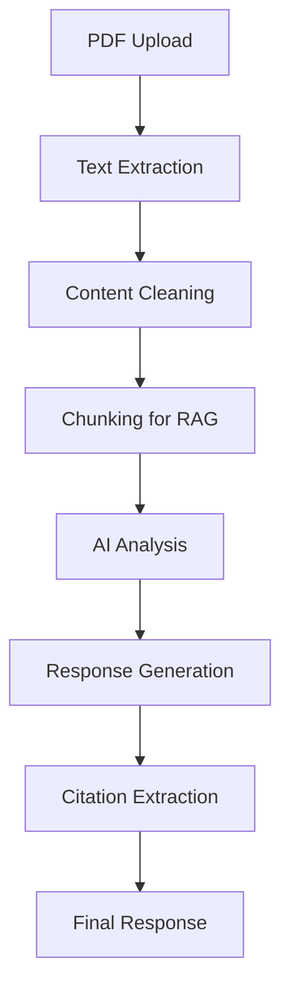

# API Documentation - Google NotebookLM Clone

This document provides comprehensive documentation for the Google NotebookLM Clone API endpoints and AI integration.

## 🔧 API Endpoints

### PDF Processing

#### `POST /api/process-pdf`
Processes uploaded PDF documents and extracts text content.

**Request:**
```typescript
{
  pdfDataUri: string // Base64 encoded PDF data URI
}
```

**Response:**
```typescript
{
  text?: string    // Extracted text content
  error?: string   // Error message if processing fails
}
```

**Example:**
```javascript
const response = await fetch('/api/process-pdf', {
  method: 'POST',
  headers: { 'Content-Type': 'application/json' },
  body: JSON.stringify({
    pdfDataUri: 'data:application/pdf;base64,JVBERi0xLjQK...'
  })
});
```

### Chat Interface

#### `POST /api/ask-question`
Processes user questions about PDF content using AI.

**Request:**
```typescript
{
  question: string    // User's question
  pdfContent: string  // PDF text content
}
```

**Response:**
```typescript
{
  answer?: string      // AI-generated answer
  citations?: string[] // Page references
  error?: string       // Error message if processing fails
}
```

**Example:**
```javascript
const response = await fetch('/api/ask-question', {
  method: 'POST',
  headers: { 'Content-Type': 'application/json' },
  body: JSON.stringify({
    question: 'What is the main topic of this document?',
    pdfContent: 'Document text content...'
  })
});
```

## 🤖 AI Integration

### AI Models and Their Specific Jobs

#### **1. Google Gemini Pro Latest** 
**🎯 Primary Job: Chat Responses (Q&A)**
- **What it does:** Answers user questions about PDF content
- **When used:** First choice for chat responses
- **Model:** `gemini-pro-latest`
- **Rate Limit:** 2 requests/minute (free tier)
- **Purpose:** Provides NotebookLM-like experience
- **Location:** `src/ai/flows/answer-questions-about-pdf.ts`

#### **2. Groq API (Llama 3.1 8B Instant)**
**🎯 Two Jobs:**
1. **Chat Responses (Fallback)** - When Gemini is rate limited
2. **Document Vectorization** - Processing and structuring PDF content

**Chat Responses:**
- **What it does:** Answers questions when Gemini is unavailable
- **Model:** `llama-3.1-8b-instant`
- **Rate Limit:** 30 requests/minute (free tier)

**Document Vectorization:**
- **What it does:** Processes and structures PDF content for better analysis
- **Model:** `llama-3.1-8b-instant`
- **Purpose:** Creates clean, structured document content
- **Location:** `src/ai/flows/vectorize-pdf-content.ts`

### **Workflow:**

#### **When User Uploads PDF:**
1. **PDF Text Extraction** → Local processing (no AI)
2. **Groq AI** → Structures and vectorizes the content
3. **Document Analysis** → Groq AI provides initial summary

#### **When User Asks Questions:**
1. **Google Gemini** → Primary response (if available)
2. **Groq AI** → Fallback response (if Gemini rate limited)
3. **Citation Extraction** → Local processing

### **Model Comparison:**

| Model | Job | Speed | Quality | Rate Limit |
|-------|-----|-------|---------|------------|
| **Gemini Pro** | Chat Q&A | Medium | Excellent | 2/min |
| **Groq Llama** | Chat Q&A + Vectorization | Very Fast | Good | 30/min |

### Supported AI Providers

#### 1. Google Gemini Pro Latest (Primary)
- **API Endpoint:** `https://generativelanguage.googleapis.com/v1beta/models/gemini-pro-latest:generateContent`
- **Authentication:** API Key in request body
- **Rate Limits:** 2 requests per minute (free tier)
- **Best For:** High-quality responses, NotebookLM-like experience

**Setup:**
```bash
GOOGLE_API_KEY=your_google_gemini_api_key_here
```

#### 2. Groq API (Fallback)
- **API Endpoint:** `https://api.groq.com/openai/v1/chat/completions`
- **Model:** `llama-3.1-8b-instant`
- **Authentication:** Bearer token
- **Rate Limits:** 30 requests per minute (free tier)
- **Best For:** Fast responses, cost-effective

**Setup:**
```bash
GROQ_API_KEY=your_groq_api_key_here
```

#### 3. OpenAI GPT (Optional)
- **API Endpoint:** `https://api.openai.com/v1/chat/completions`
- **Model:** `gpt-3.5-turbo`
- **Authentication:** Bearer token
- **Rate Limits:** Based on subscription
- **Best For:** Premium quality, advanced reasoning

**Setup:**
```bash
OPENAI_API_KEY=sk-your_openai_api_key_here
```

### AI Response Format

#### Standard Response Structure
```typescript
{
  answer: string        // Main response content
  citations?: string[]  // Page references
  metadata?: {          // Additional information
    provider: string    // AI provider used
    tokens: number     // Token count
    processingTime: number // Response time in ms
  }
}
```

#### Error Response Structure
```typescript
{
  error: string         // Error message
  code?: string        // Error code
  details?: any        // Additional error details
}
```

## 📄 PDF Processing

### Text Extraction Methods

#### 1. Primary Method: Simple Text Extraction
- Extracts text from PDF buffer using regex patterns
- Handles most standard PDF formats
- Fast and efficient processing

#### 2. Fallback Method: Advanced Parsing
- Uses `pdf-parse` library for complex PDFs
- Handles encrypted and protected PDFs
- More comprehensive text extraction

#### 3. Error Handling
- Password-protected PDF detection
- Corrupted file handling
- Image-only PDF identification
- Graceful fallback mechanisms

### Content Processing Pipeline



## 🔍 Vectorization & RAG

### Document Chunking
```typescript
interface DocumentChunk {
  content: string      // Chunk text content
  pageNumber: number   // Source page number
  startIndex: number   // Character start position
  endIndex: number     // Character end position
  metadata: {          // Additional chunk information
    section?: string   // Document section
    heading?: string   // Associated heading
  }
}
```

### RAG Implementation
- **Chunk Size:** 512 characters with 128 character overlap
- **Retrieval:** Semantic similarity matching
- **Generation:** Context-aware response generation
- **Citation:** Page-specific reference extraction

## 📱 Mobile API Support

### Responsive Endpoints
All API endpoints are optimized for mobile devices:
- Reduced payload sizes
- Compressed responses
- Touch-optimized interactions
- Progressive loading

### Mobile-Specific Features
- **Image Optimization:** Automatic image compression
- **Touch Events:** Gesture-based navigation
- **Offline Support:** Cached responses
- **Performance:** Optimized for mobile networks

## 🔒 Security & Authentication

### API Key Management
```typescript
// Environment variable validation
const validateApiKey = (key: string, provider: string): boolean => {
  // Validate API key format
  // Check provider-specific requirements
  // Verify key permissions
}
```

### Rate Limiting
```typescript
// Rate limiting implementation
const rateLimits = {
  google: { requests: 15, window: 60000 },    // 15 req/min
  groq: { requests: 30, window: 60000 },      // 30 req/min
  openai: { requests: 60, window: 60000 }      // 60 req/min
}
```

### CORS Configuration
```typescript
// CORS settings for production
const corsOptions = {
  origin: process.env.ALLOWED_ORIGINS?.split(',') || ['http://localhost:9002'],
  credentials: true,
  optionsSuccessStatus: 200
}
```

## 📊 Performance Metrics

### Response Time Targets
- **PDF Processing:** < 5 seconds
- **AI Response:** < 10 seconds
- **Citation Generation:** < 2 seconds
- **Mobile Loading:** < 3 seconds

### Optimization Strategies
- **Caching:** Response caching for repeated queries
- **Compression:** Gzip compression for API responses
- **CDN:** Static asset delivery via CDN
- **Database:** Optimized queries and indexing

## 🐛 Error Handling

### Common Error Codes
```typescript
enum ErrorCodes {
  PDF_PROCESSING_FAILED = 'PDF_PROCESSING_FAILED',
  AI_SERVICE_UNAVAILABLE = 'AI_SERVICE_UNAVAILABLE',
  INVALID_API_KEY = 'INVALID_API_KEY',
  RATE_LIMIT_EXCEEDED = 'RATE_LIMIT_EXCEEDED',
  CONTENT_TOO_LARGE = 'CONTENT_TOO_LARGE'
}
```

### Error Response Format
```typescript
{
  error: string,
  code: ErrorCodes,
  message: string,
  timestamp: string,
  requestId: string
}
```

## 🔄 Webhook Support

### Event Notifications
```typescript
// Webhook payload structure
interface WebhookPayload {
  event: 'pdf.processed' | 'ai.response.generated' | 'error.occurred',
  data: {
    documentId: string,
    status: 'success' | 'error',
    metadata: any
  },
  timestamp: string
}
```

## 📈 Analytics & Monitoring

### Metrics Collection
- **API Usage:** Request/response times
- **Error Rates:** Failed request tracking
- **User Engagement:** Feature usage statistics
- **Performance:** Core Web Vitals monitoring

### Logging
```typescript
// Structured logging
interface LogEntry {
  level: 'info' | 'warn' | 'error',
  message: string,
  metadata: {
    userId?: string,
    requestId: string,
    timestamp: string,
    duration?: number
  }
}
```

## 🚀 Deployment Considerations

### Environment Variables
```bash
# Required
GOOGLE_API_KEY=your_key_here
GROQ_API_KEY=your_key_here

# Optional
OPENAI_API_KEY=your_key_here
NODE_ENV=production
PORT=3000

# Security
CORS_ORIGIN=https://yourdomain.com
RATE_LIMIT_WINDOW=60000
RATE_LIMIT_MAX=100
```

### Health Checks
```typescript
// Health check endpoint
GET /api/health
{
  status: 'healthy',
  services: {
    pdf: 'operational',
    ai: 'operational',
    database: 'operational'
  },
  timestamp: '2024-01-01T00:00:00Z'
}
```

---

**API Documentation Complete! 🚀**

For additional support or questions, please refer to the main README.md or open an issue in the repository.
